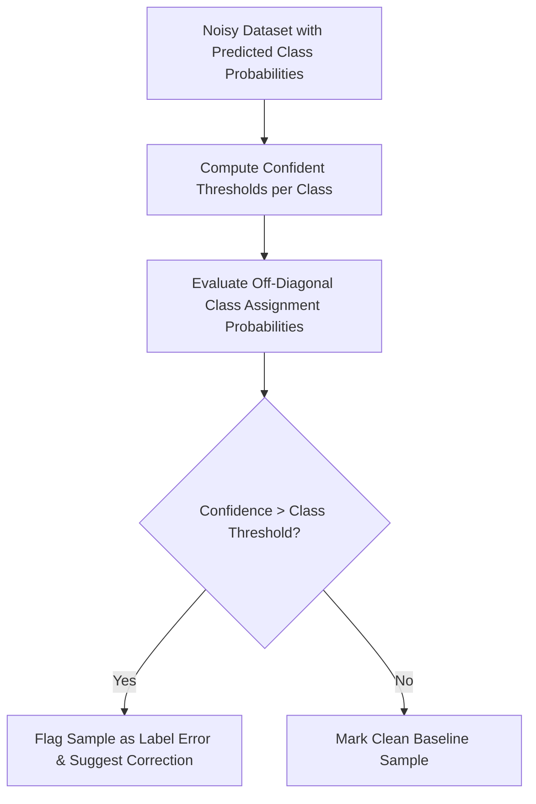

# GenPark AI Agent Skill - Label Noise Confident Learning Pruner

Estimates joint dataset label distributions to isolate mislabeled training records and contaminated synthetic datasets.

Verified by [GenPark AI](https://genpark.ai) and compatible with [Model Context Protocol (MCP)](https://genpark.ai/mcp).

## Architecture Diagram

## Features
- **Theoretical Grounding**: Implements Northcutt et al. confident learning principles.
- **Zero External Dependencies**: Pure Python 3.9+ standard library.
